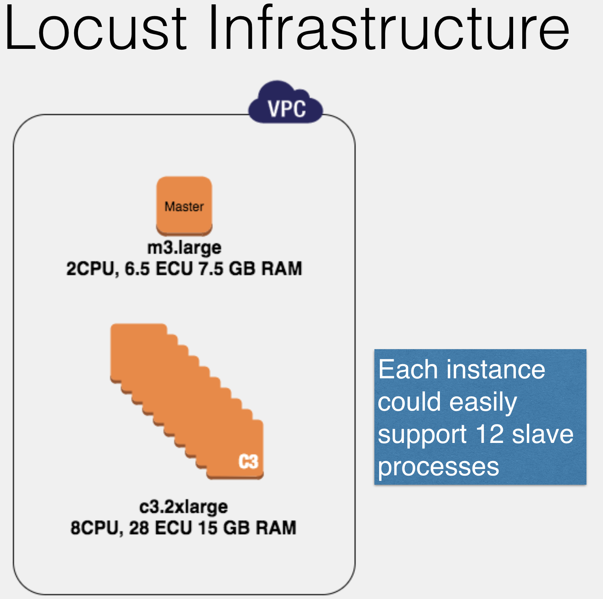

Scaling Locust
--------------

One of the core strengths of locust is its ability to scale across multiple machines.  It does this by running one process as the `master`.  The remaining processes connect to master and send their load test metrics.

For instance, to run 120 slave processes you might set up something like this:



Note: Every locust process must have the same `locustfile`.

It's possible you'll need to optimize the system under test before you stress out locust enough to need to distribute it.

The general formula is:

1.  Adding additional users doesn't seem to increase requests per second
1.  The system under test seems underutilized
1.  The locust process is overutilized (High CPU).

[Digital Ocean](https://www.digitalocean.com/community/tutorials/how-to-use-top-netstat-du-other-tools-to-monitor-server-resources#top) has a good rundown of various system monitoring tools you can use in linux.

_Note: More machines will raise your costs for the workshop.  **Remember to tear everything down!**_

## Basic Outline

1. Create a second locust EC2 instance following the instructions in [Setup AWS](../getting_started_with_aws.md).
1. Make sure the second machine has the same locust file.  You can use git:  `git checkout find_baseline`
1. You'll need to open up more ports so that the locust machines can communicate.  In the AWS EC2 web console scroll the left sidebar and select Security Groups.  Edit your `codemash18` group and add inbound rules for `5557` and `5558`.
1. For the master process you'll need to add `--master` to your command:

    ```bash
    ubuntu@locust:~/loadtest$ locust --host http://<Saleor DNS> --master
    ```
    
1.  The slave processes will need a `--slave` switch and the `--master-host` switch.  `--master-host` will be the DNS name of the master node.

    ```bash
    ubuntu@locust:~/loadtest$ locust --host http://<Saleor DNS> --slave --master-host <Master DNS>
    ```
    
1. Connect to the master machine and start the test. Open a browser to `http://<Master DNS>:8089`
1. When you run your test, the master machine will distribute the number of simulated users evenly among the locust processes.  So if you have 1 slave and 1 master, 100 locusts would be split 50/50.

Full docs [here](https://docs.locust.io/en/latest/running-locust-distributed.html)

## Next Steps

How many slaves can your hardware support?  To figure this out, you'll want to start your load test and then monitor the locust machines for high CPU.  In past environments we've been able to run between 1 and 2 slaves per machine core.

_**Remember to tear everything down!**_
