Purchase Script Walkthrough
---------------------------

## Objective
Create a locust script that can complete a purchase with saleor

## Prerequisities
* Saleor running and accessible via web browser
* Browser Dev Tools
* Locust installed on ec2 node
* SSH to locust machine

## Getting started

### Open browser to Saleor instance
1. Go into the ec2 web view and copy the `Public DNS` value

1. Open a browser to that URL `http://<Saleor DNS>` (Chrome will be used below):

1. Open Dev Tools
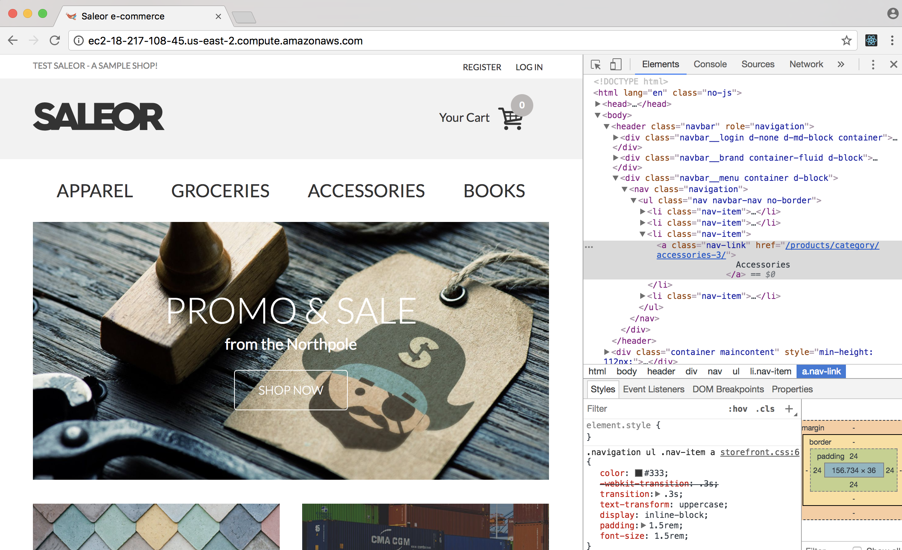

### Investigate purchasing
Our goal is to emulate what a user might do via the browser in our loadtest script.  Purchasing is a multi-step process.  First we find a product we like, then we add it to the cart, then we go through a basic checkout process.
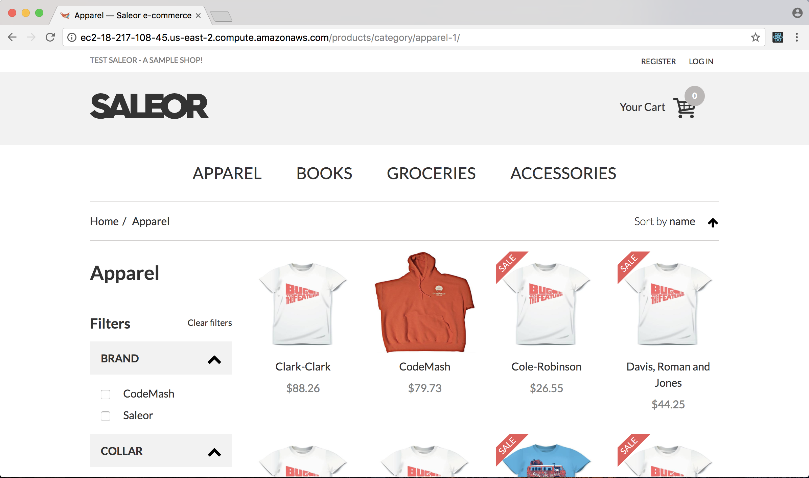
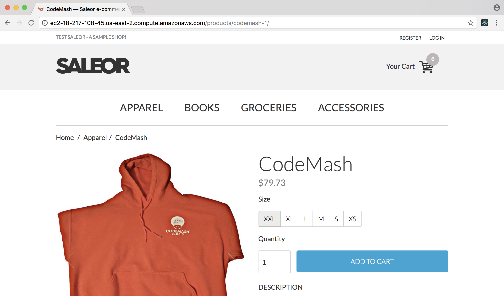
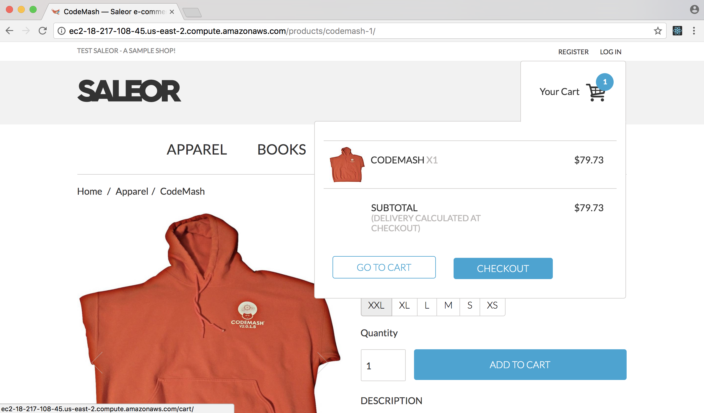
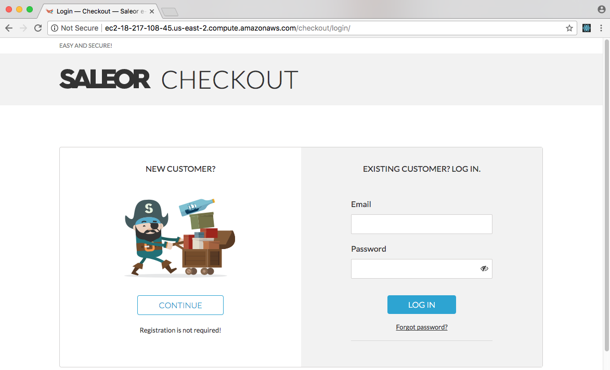
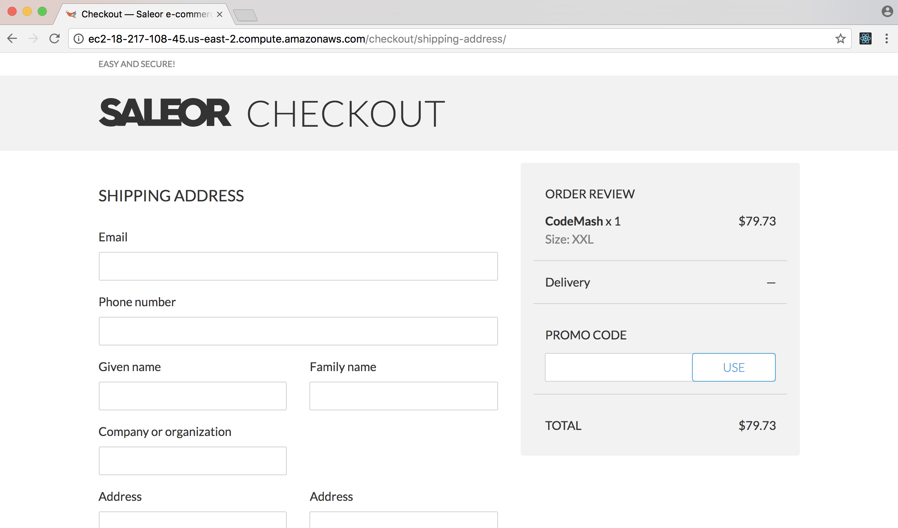
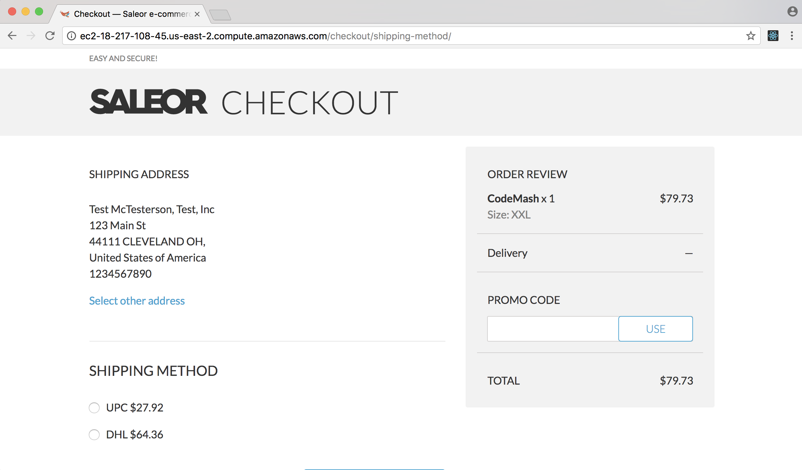

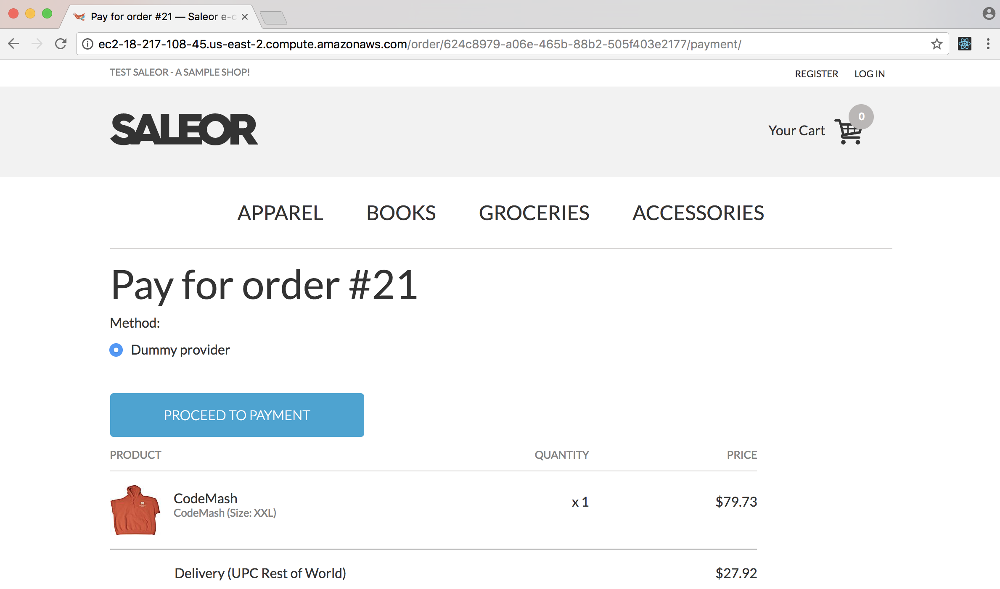

So we'll want locust to simulate going to these pages and filling out the forms.

### Investigate locust
1. Next, use a console to SSH into your locust machine.

1. On the locust machine, update git so that we're at a good starting point.

    ```bash
    ubuntu@locust:~$ cd ~/loadtest
    ubuntu@locust:~/loadtest$ git fetch origin
    ubuntu@locust:~/loadtest$ git reset --hard origin/buy_script
    ```

1. Open `locustfile.py` in your text editor of choice.
Looking at the file, you'll find that things are defined somewhat bottom-up.  In python you can't use names that are defined later in the file,  so our helpers are defined first.
So if we start at the bottom, we'll find the `Visitor` class:

    ```python
    class Visitor(HttpLocust):
        task_set = VisitorBehavior
        min_wait = 5000
        max_wait = 10000
    ```

    The `Visitor` class is a "locust" in our LoadTest.  Each locust is a user that will follow a `task_set`.  The `min_wait` and `max_wait` provide the window where our user will wait between tasks.  So this locust will do one task from `VisitorBehavior` and then wait 5-10 seconds before doing another task.  We'll get into more of this when we talk about user funnel.

    Above `Visitor` is `VisitorBehavior`:

    ```python
    class VisitorBehavior(TaskSet):
        @task
        def buy(self):
            pass
    ```

    This is the `TaskSet` for our `Visitor` locust.  Tasks are just python methods with a `@task` decorator.  For this exercise we'll fill in the `buy` task.

    The top of the file is imports and a `Helpers` class.  We won't modify these during the workshop.  They're here so they can be used by our locust tasks.

## Purchase Hoodie

Back in our web browser, we want to investigate how saleor works so we can simulate that same behavior in locust.  In our scenario, we believe that there will be a large demand for the exclusive and ever elusive CodeMash hoodie.  This garment of mystery is said to give the average wearer +10 intelligence, +2 charisma, and +11 snuggliness.

### Home Page

The first thing we believe a user would do is visit the home page.  So let's visit that page via locust.

```python
def buy(self):
    self.client.get("/")
```

The DSL for locust makes this pretty simple.  We use our `client` provided by the `TaskSet` parent class to perform http requests.  In general, `self.client` is very similar to using a web-browser, it will keep session state, cookies, etc.  It's built on the [requests](http://docs.python-requests.org/en/master/) library if you're familiar with that.

So in this step, we're doing a GET HTTP request to the `/` route.  Don't worry about the missing host information, we'll inject that later.

### Apparel page


Looking at the home page, we see that there are categories for products.  Thinking like our poor hoodie-less user, we might start in the apparel category:


Looking at the browser URL that seems to be the `/products/category/apparel-1/` route.  So update our script:

```python
def buy(self):
    self.client.get("/")
    self.client.get("/products/category/apparel-1/")
```

### Hoodie page

Aha!  The object of our quest!
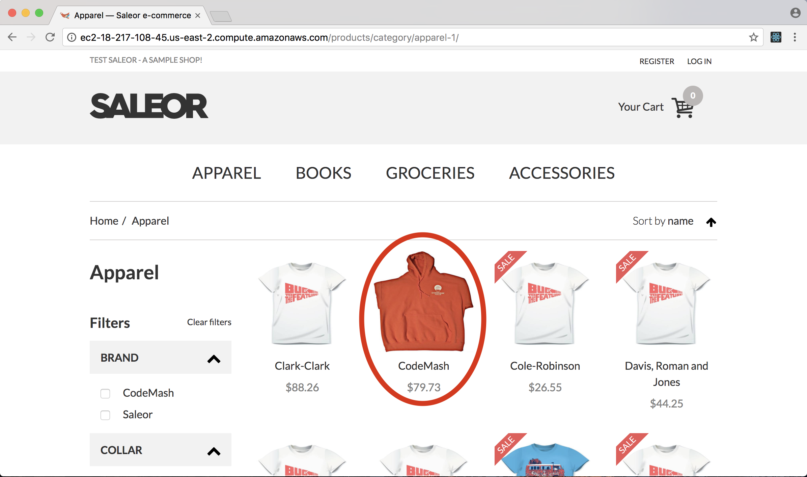


Perfect!
Looking at the browser URL that seems to be the `/products/codemash-1/` route.  So update our script:

```python
def buy(self):
    self.client.get("/")
    self.client.get("/products/category/apparel-1/")
    self.client.get("/products/codemash-1/")
```

### Add to Cart

Up to this point we've just visited some pages.  Now it's time to finally start the process of making that hoodie ours.


On every product page there is a prominent "ADD TO CART" button.  Let's see what happens when we click that button.  For this, use the "Networks" tab of browser dev tools.  You may want to use the "Preserve log" setting so the requests don't disappear when a page changes.

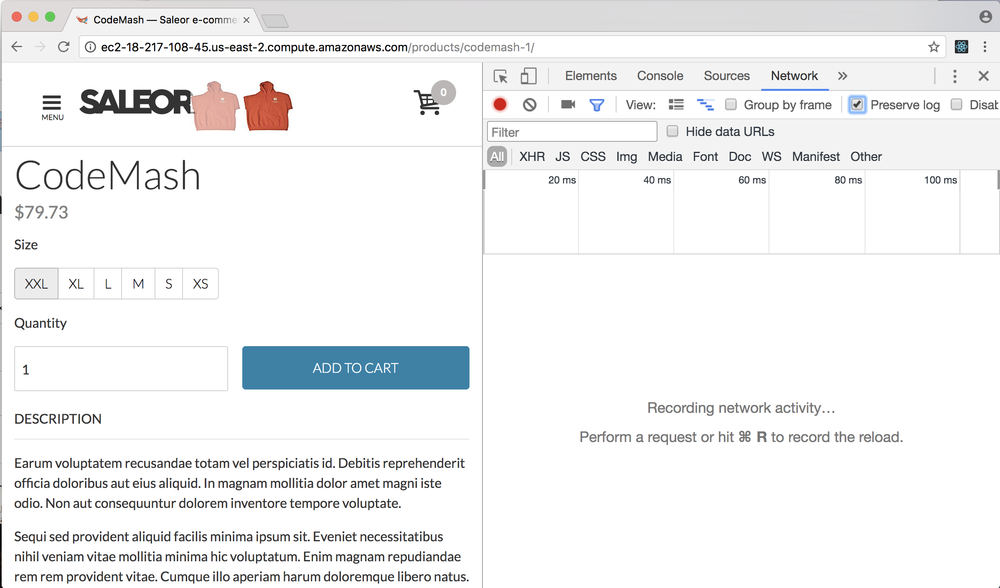

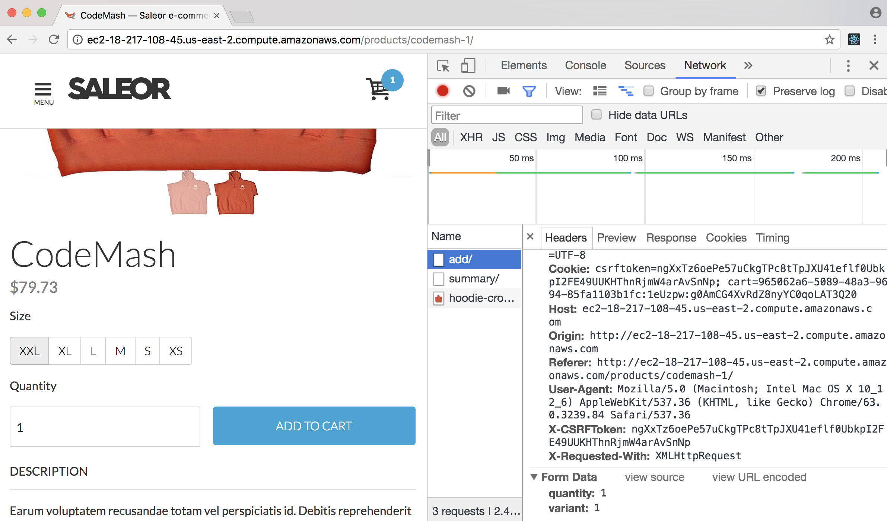


There's our parameters:

```
quantity:1
variant:1
```

If you inspect this network request carefully, you'll find it's an ajax call - these kind of requests allow a client to send/receive data to the server without changing the loaded page.  We have a helper function for these requests to handle some strangeness around cookies and CSRF tokens.

```python
def buy(self):
    self.client.get("/")
    self.client.get("/products/category/apparel-1/")
    self.client.get("/products/codemash-1/")
    self.post_ajax("/products/codemash-1/add/", {"quantity":1, "variant":1 })
```

### Checkout

Now that we have a an item in our cart, we can proceed to checkout.


```python
def buy(self):
    self.client.get("/")
    self.client.get("/products/category/apparel-1/")
    self.client.get("/products/codemash-1/")
    self.post_ajax("/products/codemash-1/add/", {"quantity":1, "variant":1 })
    response = self.client.get("/checkout/")
```

### Shipping Address

This is the first form we'll need to fill out to complete checkout.


_Note:  This page uses a lot of the techniques from [signup](signup.md#submit-the-form).  Refer back to that page for a more detailed explanation._

So if we fill out and submit the form we'll be able to see the form fields in the networks tab.  As expected, one of the necessary fields is the `csrfmiddlewaretoken` so we'll need to pull that off the page to use in our form submission.

```python
def buy(self):
    self.client.get("/")
    self.client.get("/products/category/apparel-1/")
    self.client.get("/products/codemash-1/")
    self.post_ajax("/products/codemash-1/add/", {"quantity":1, "variant":1 })
    response = self.client.get("/checkout/")
    csrf_token = self.parse_csrf(response.text)
    response = self.client.post("/checkout/shipping-address/", {
        "csrfmiddlewaretoken":csrf_token,
        "email":fake.email(),
        "phone":"1234567890",
        "first_name": fake.first_name(),
        "last_name": fake.last_name(),
        "company_name": fake.company(),
        "street_address_1": fake.street_address(),
        "street_address_2": "",
        "city": "The Land",
        "country_area": "OH",
        "postal_code": "44111",
        "country": "US",
    })
```

Much like [signup](signup.md#a-small-complication) we'll use [Faker](http://faker.readthedocs.io/en/master/) to make the data more interesting.

###  Shipping Method

Next we pick our shipping method:


Same process as Shipping Address, fill out the form and check the network tab in dev tools.  Add this form to our locust script:

```python
def buy(self):
    self.client.get("/")
    self.client.get("/products/category/apparel-1/")
    self.client.get("/products/codemash-1/")
    self.post_ajax("/products/codemash-1/add/", {"quantity":1, "variant":1 })
    response = self.client.get("/checkout/")
    csrf_token = self.parse_csrf(response.text)
    response = self.client.post("/checkout/shipping-address/", {
        "csrfmiddlewaretoken":csrf_token,
        "email":fake.email(),
        "phone":"1234567890",
        "first_name": fake.first_name(),
        "last_name": fake.last_name(),
        "company_name": fake.company(),
        "street_address_1": fake.street_address(),
        "street_address_2": "",
        "city": "The Land",
        "country_area": "OH",
        "postal_code": "44111",
        "country": "US",
    })
    csrf_token = self.parse_csrf(response.text)
    response = self.client.post("/checkout/shipping-method/", {
        "csrfmiddlewaretoken":csrf_token,
        "method": "1"
    })
```

###  Billing Address

For this form, we'll take the easy way out and say "Same as Shipping".


Submit the form, check the network tab and add it to our locust script:

```python
def buy(self):
    self.client.get("/")
    self.client.get("/products/category/apparel-1/")
    self.client.get("/products/codemash-1/")
    self.post_ajax("/products/codemash-1/add/", {"quantity":1, "variant":1 })
    response = self.client.get("/checkout/")
    csrf_token = self.parse_csrf(response.text)
    response = self.client.post("/checkout/shipping-address/", {
        "csrfmiddlewaretoken":csrf_token,
        "email":fake.email(),
        "phone":"1234567890",
        "first_name": fake.first_name(),
        "last_name": fake.last_name(),
        "company_name": fake.company(),
        "street_address_1": fake.street_address(),
        "street_address_2": "",
        "city": "The Land",
        "country_area": "OH",
        "postal_code": "44111",
        "country": "US",
    })
    csrf_token = self.parse_csrf(response.text)
    response = self.client.post("/checkout/shipping-method/", {
        "csrfmiddlewaretoken":csrf_token,
        "method": "1"
    })
    csrf_token = self.parse_csrf(response.text)
    response = self.client.post("/checkout/summary/", {
        "csrfmiddlewaretoken":csrf_token,
        "address": "shipping_address"
    })
```

### Payment Method

Saleor ships with many options for configuring payment providers.  To make this demo as simple as possible, we'll use the dummy provider that fakes out payment processing.  In a realistic scenario, you'll want to have some level of certainty around your payment provider to ensure they can handle your expected load.  Nothing worse than intermittent bugs during payment collection!


And we'll complete our script by "submitting payment":

```python
def buy(self):
    self.client.get("/")
    self.client.get("/products/category/apparel-1/")
    self.client.get("/products/codemash-1/")
    self.post_ajax("/products/codemash-1/add/", {"quantity":1, "variant":1 })
    response = self.client.get("/checkout/")
    csrf_token = self.parse_csrf(response.text)
    response = self.client.post("/checkout/shipping-address/", {
        "csrfmiddlewaretoken":csrf_token,
        "email":fake.email(),
        "phone":"1234567890",
        "first_name": fake.first_name(),
        "last_name": fake.last_name(),
        "company_name": fake.company(),
        "street_address_1": fake.street_address(),
        "street_address_2": "",
        "city": "The Land",
        "country_area": "OH",
        "postal_code": "44111",
        "country": "US",
    })
    csrf_token = self.parse_csrf(response.text)
    response = self.client.post("/checkout/shipping-method/", {
        "csrfmiddlewaretoken":csrf_token,
        "method": "1"
    })
    csrf_token = self.parse_csrf(response.text)
    response = self.client.post("/checkout/summary/", {
        "csrfmiddlewaretoken":csrf_token,
        "address": "shipping_address"
    })
    csrf_token = self.parse_csrf(response.text)
    response = self.client.post(response.url, {
        "csrfmiddlewaretoken":csrf_token,
        "method": "default"
    }, name="/order/[order-id]/payment")
```

Locust provides the ability to create a friendly `name` for a request so that it's easier to find in the locust UI.  This is useful when dealing with requests that have dynamic URLs. In our case above, the payment fmethod is tied to the dynamically generated order ID.  If we don't use `name`, the locust UI will quickly fill with a unique row for each order; this `name` allows us to aggregate all of the payment method requests in one report line.

## Fire up locust

1. Save the file and close your editor
1. Re-find/copy the public DNS name for saleor: `http://<Saleor DNS>`
1. Start locust:

    ```bash
    ubuntu@locust:~/loadtest$ locust --host http://<Saleor DNS>
    ```
    It should look something like this:

    ```bash
    ubuntu@locust:~/loadtest$ locust --host http://ec2-18-217-108-45.us-east-2.compute.amazonaws.com
    [2017-12-24 02:58:54,522] ip-172-31-43-238/INFO/locust.main: Starting web monitor at *:8089
    [2017-12-24 02:58:54,522] ip-172-31-43-238/INFO/locust.main: Starting Locust 0.8
    ```

1. Now we need the Public DNS for the Load Test machine:


1. Open a browser to `http://<LoadTest DNS>:8089`


1. Enter 1 for "Number of users" and "Hatch rate".  Click "Start swarming"

1. Verify that requests are happening and that there are no failures.  Success!
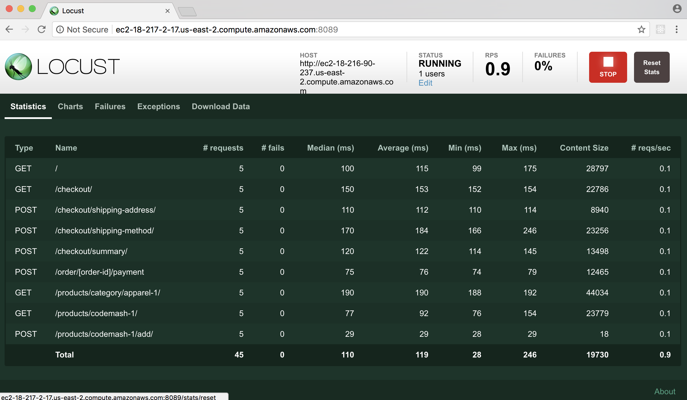

## Conclusion
You've successfully written a load test script that can handle a complex user flow.  Your script can handle dynamic data and be run multiple times without changing the production app.  At this point you've tested it with one simulated user, but locust makes it very simple to scale that load up by editing a running test or restarting the test with more users.
