# Getting Started with AWS and EC2

## Sign up for AWS free account

1. Navigate to [http://aws.amazon.com](http://aws.amazon.com) and sign up for a new account. (Note: you will need a payment method and active phone number to complete registration)
2. When registration is completed and you are signed in, navigate to [https://console.aws.amazon.com](https://console.aws.amazon.com).


## Provision an EC2 Instance for Saleor (our e-commerce system-under-test)

1. Navigate to [https://console.aws.amazon.com](https://console.aws.amazon.com).
1. Use the search field under "AWS Services" to search for EC2 
<br/>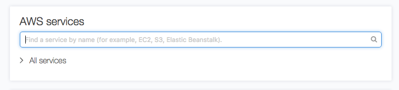
2. Click on **EC2**.
<br/>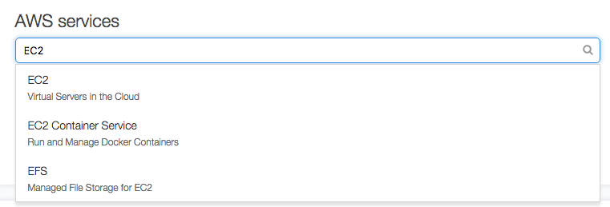
3. Click on **Launch Instance**.
<br/>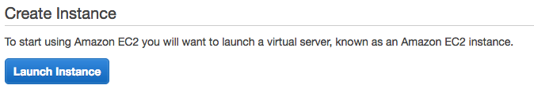
4. Find the Amazon Machine Image (AMI) __provided by the instructors for Saleor__ by selecting **Community AMIs** and typing in the AMI ID in the Search window. When it appears, press the **Select** button next to it.
<br/>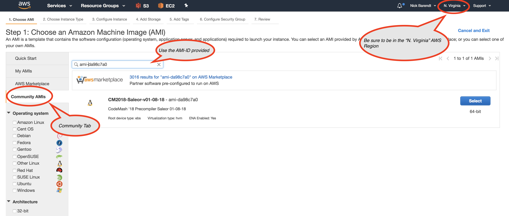
5. Choose an instance type of **m5.large** and click **Review and Launch**.
<br/>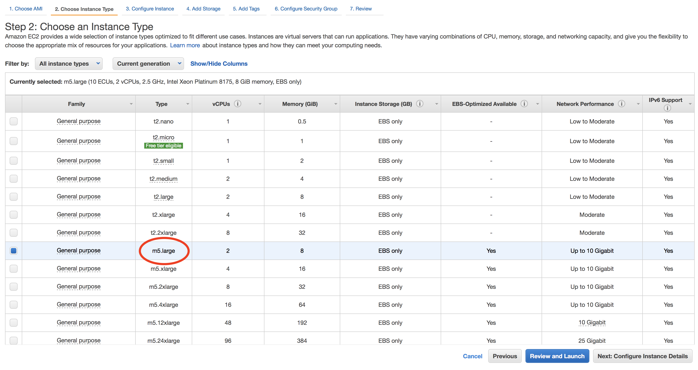
5. Select **Edit Security Group**
<br/>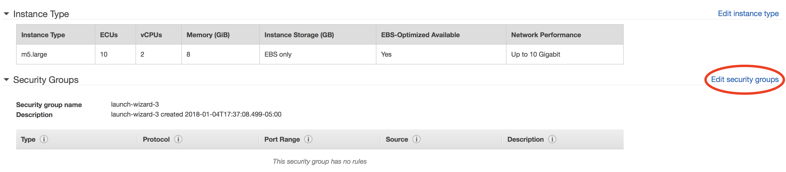
5. Configure a new security group named **codemash18** with inbound rules like the image below (ports 22 for SSH, 80 for HTTP, 8000 for the Django Development server, and 8089 for the Locust Webserver):
<br/>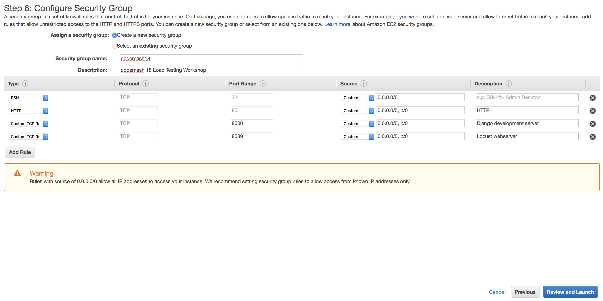
<br/> and click **Review and Launch**
5. Scroll to the bottom of page and select **Edit Tags**
<br/>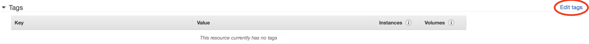
5. Add a tag **Name** with a value of **saleor** (this will help keep track of which instance is which later on - our System Under Test (saleor) or our load generating system (locust).
<br/>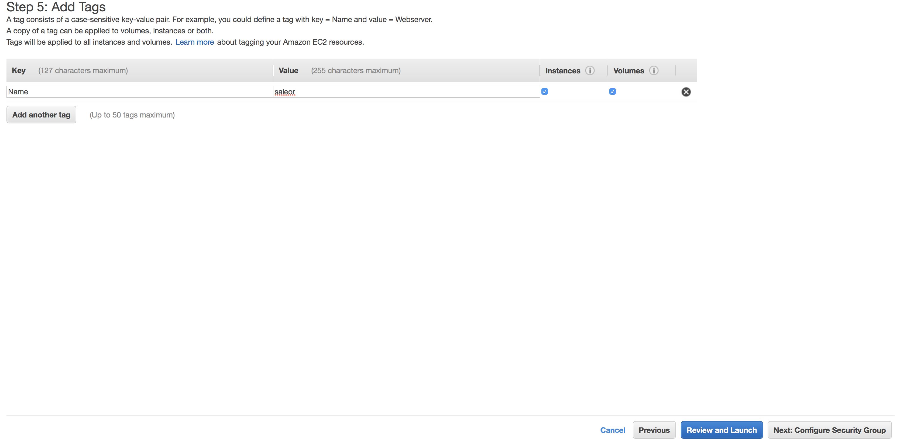
<br/> and click **Review and Launch**
5. Now click **Launch**!
6. You'll be asked for a key pair. Select **Create a new key pair**, give it a name **codemash18**, and click **Download Key Pair**.
<br/>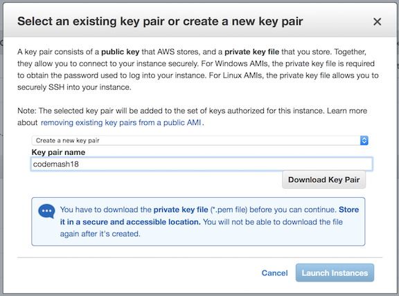
7. This will create a key and download the private key on your local machine.
8. If the file saves to your computer with a **.txt** file extention, rename it to have a **.pem** extension.
9. On OS X and Linux, restrict permissions on the key. ssh will require this later:

    ```
    host$ chmod 400 <path_to_your_pem_file>
    ```

10. Click **Launch Instance**.
11. You can monitor the Instance state as it starts up by monitoring select **Instances** from the **EC2 Dashboard**
<br/>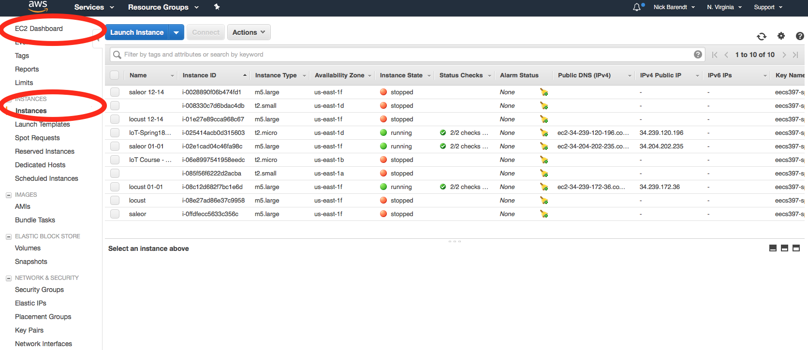
12. Once your **Saleor** instance has reached the **Running** **Instance State** you can connect to it with your web browser.
13. Select the **Saleor** instance to bring up its details.  Copy the **Public DNS** value to the Clipboard
<br/>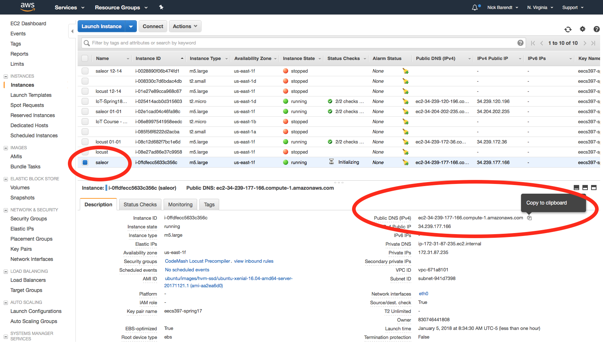 
15.  Paste the **Public DNS** value to your browser and test that Saleor is working
<br/>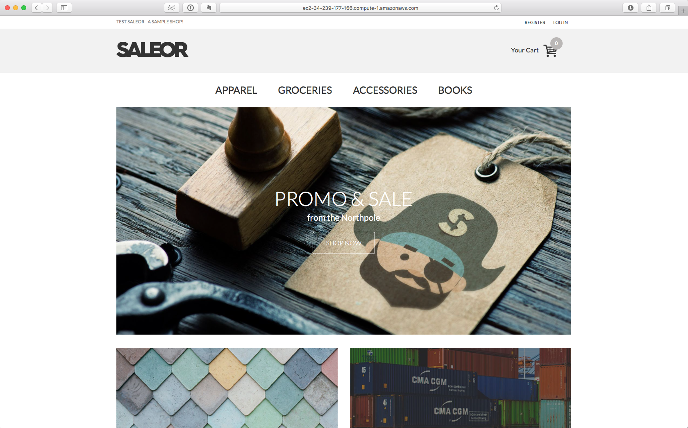

### Set Up Billing Alerts

We recommend you go to [https://console.aws.amazon.com/billing/](https://console.aws.amazon.com/billing/) and configure **billing alerts** that will let you know if you start getting charges on your account. If you make a mistake or start getting unexpected traffic you'll be able to react quickly and avoid getting any surprising charges.


## Provision an EC2 Instance for Locust (our load testing system)

1. Follow the instructions from above for "Provision an EC2 Instance for Saleor (our e-commerce system-under-test)" with following changes:
1.  Use the AMI ID provided by the instructors for **Locust**
1.  Do not create a new **Security Group** - select the **codemash18** group created when you launched your Saleor instance
1.  When you add the **Name** Tag, use a value of **locust**

## Log into Locust EC2 Remotely with SSH

**WARNING!!!! THIS IS HORRIBLY INSECURE!!!!**

To make it easier for participants who are not familiar with SSH, PKI, etc. we have enabled password-based login for the **Saleor** and **Locust** EC2 Instances.  This is horribly insecure.  Do not do this, ever.  You have been warned.

If you know how to use Keys with SSH, feel free to do so for the workshop.


1. Open EC2 Dashboard at [https://console.aws.amazon.com/ec2/](https://console.aws.amazon.com/ec2/). Click on **Instances**.
<br/>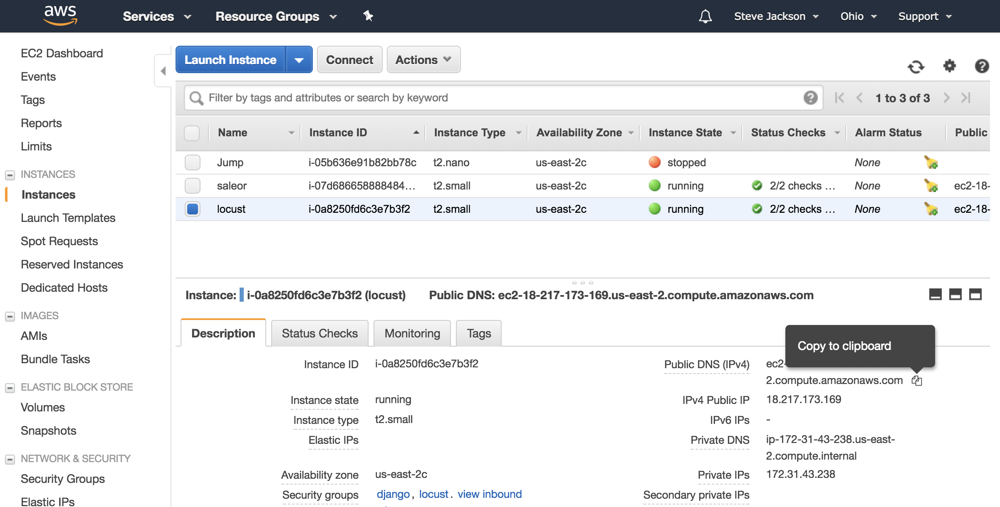
2. Copy the Public DNS Hostname of the instance, and initiate an SSH connection.Use **ubuntu** as the username.  On Mac OS X and Linux you can use the following from a terminal:

    ```
    host$ ssh ubuntu@<ec2_public_dns>
    ```

    > Use **CodeMash2018** when prompted for the password.
3. Since this is the first time you are connecting to this server you will likely be prompted about the server's key fingerprint.  Respond **yes**.
4. You should have a login (depending on your SSH client and terminal settings, your screen may look much different)
<br/>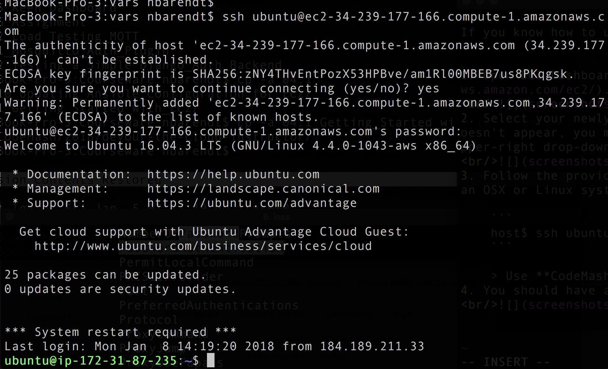


