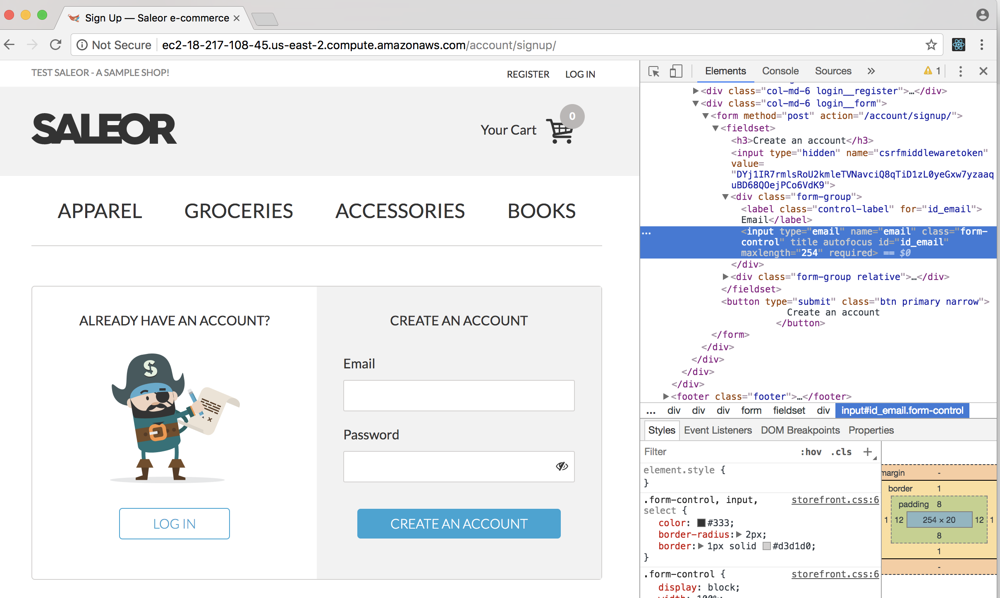
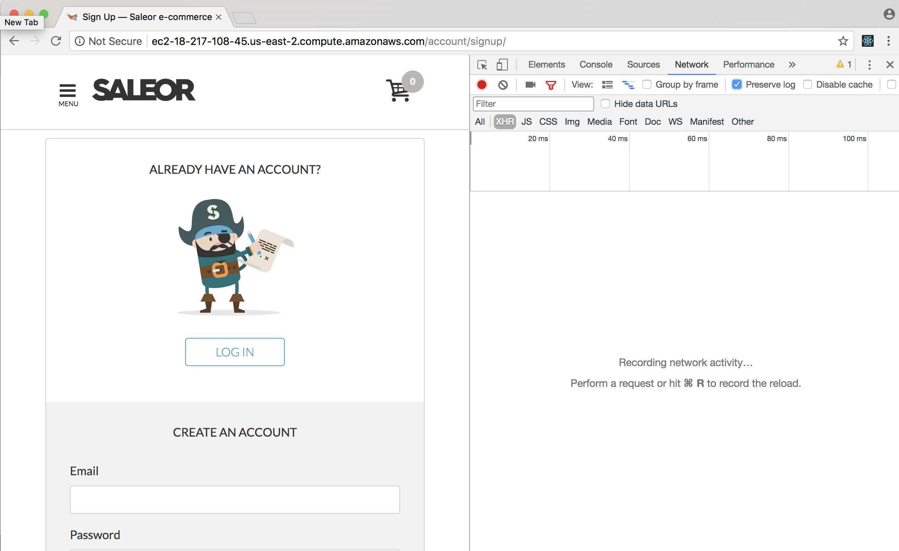
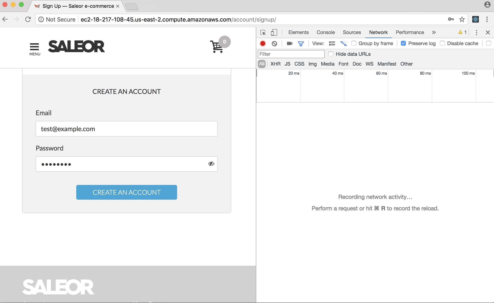
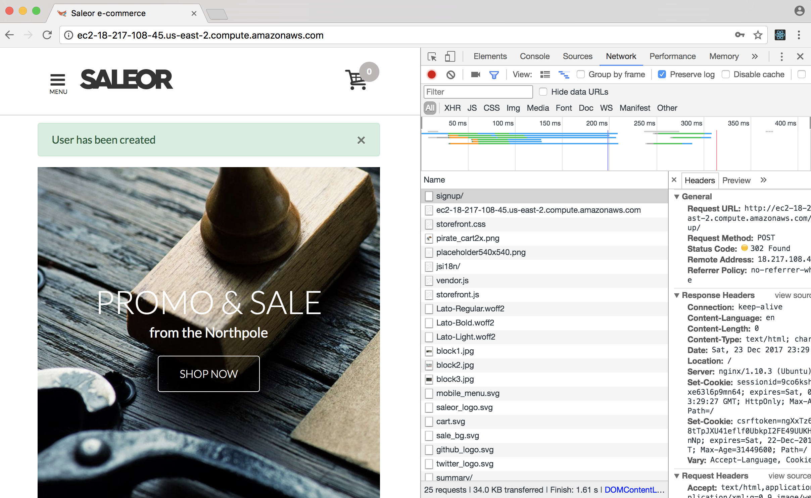
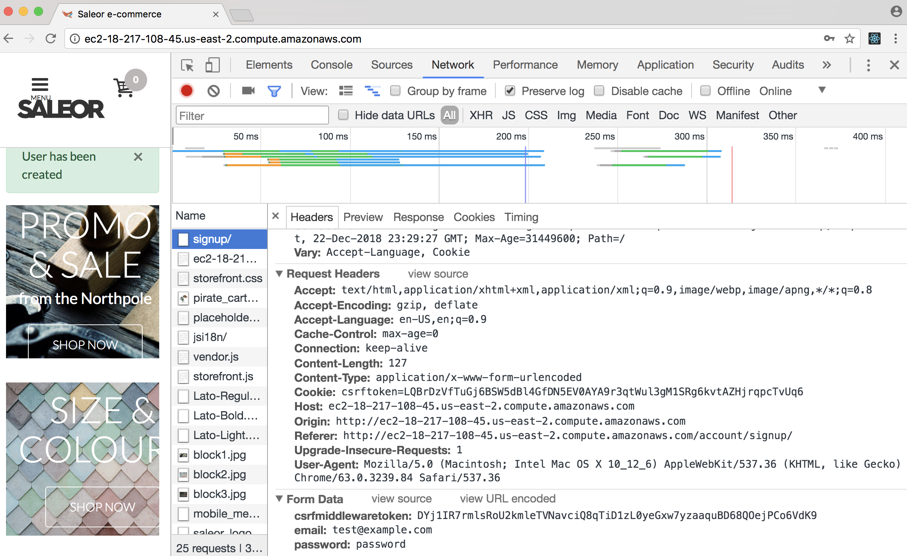
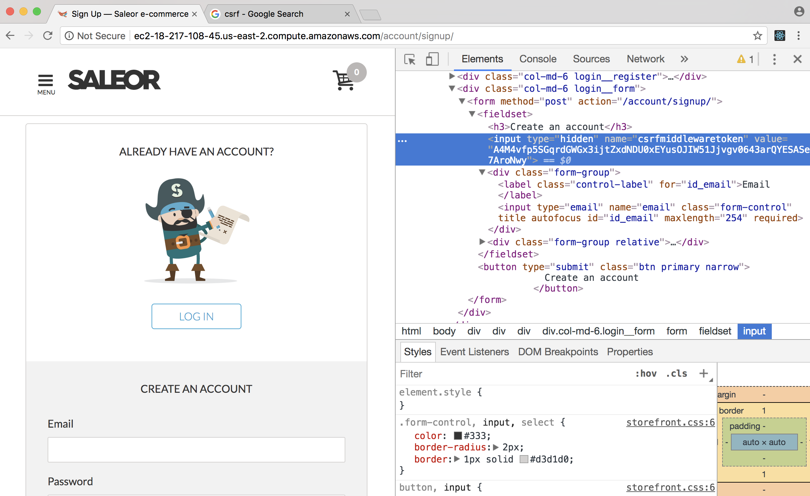
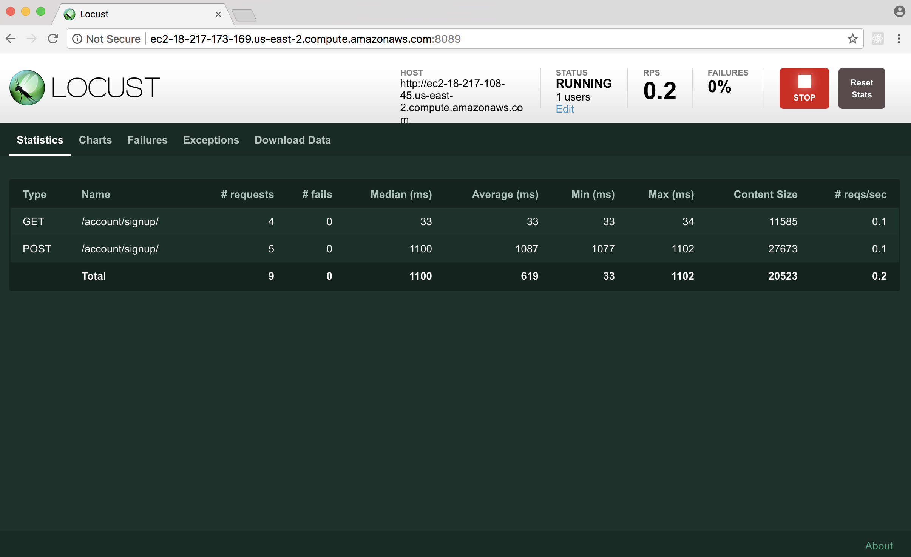

Signup Script Walkthrough
-------------------------

## Objective
Create a locust script that can sign up with saleor

## Prerequisites
* Saleor running and accessible via web browser
* Browser Dev Tools
* Locust installed on ec2 node
* SSH to locust machine

## Getting started

### Open browser to Saleor instance
1. Go into the ec2 web view and copy the `Public DNS` value

1. Open a browser to that URL `http://<Saleor DNS>` (Chrome will be used below):

1. Open Dev Tools


### Investigate registration
Our goal is to emulate what a user might do via the browser in our loadtest script.  The registration form is pretty simple, click on "Register" to investigate it.


So we'll want locust to simulate going to this page, filling in an email and password, and clicking "Create an Account"

### Investigate locust
1. Next, use a console to SSH into your locust machine.

1. On the locust machine, update git so that we're at a good starting point.

    ```bash
    ubuntu@locust:~$ cd ~/loadtest
    ubuntu@locust:~/loadtest$ git fetch origin
    ubuntu@locust:~/loadtest$ git reset --hard origin/signup_script
    ```

1. Open `locustfile.py` in your text editor of choice.
Looking at the file, you'll find that things are defined somewhat bottom-up.  In python you can't use names that are defined later in the file,  so our helpers are defined first.
So if we start at the bottom, we'll find the `Visitor` class:

    ```python
    class Visitor(HttpLocust):
        task_set = VisitorBehavior
        min_wait = 5000
        max_wait = 10000
    ```

    The `Visitor` class is a "locust" in our LoadTest.  Each locust is a user that will follow a `task_set`.  The `min_wait` and `max_wait` provide the window where our user will wait between tasks.  So this locust will do one task from `VisitorBehavior` and then wait 5-10 seconds before doing another task.  We'll get into more of this when we talk about user funnel.

    Above `Visitor` is `VisitorBehavior`:

    ```python
    class VisitorBehavior(TaskSet):
        @task
        def register_user(self):
            pass
    ```

    This is the `TaskSet` for our `Visitor` locust.  Tasks are just python methods with a `@task` decorator.  For this exercise we'll fill in the `register_user` task.

    The top of the file is imports and a `Helpers` class.  We won't modify these during the workshop.  They're here so they can be used by our locust tasks.

## Register User

Back in our web browser, we want to investigate how saleor works so we can simulate that same behavior in locust.

### Visit the Register page
The first thing we need to do is visit the "Register" page.  If we examine the URL in our address bar, we find that is the `/account/signup/` route.  So let's visit that page via locust.

```python
def register_user(self):
    response = self.client.get("/account/signup/")
```

The DSL for locust makes this pretty simple.  We use our `client` provided by the `TaskSet` parent class to perform http requests.  In general, `self.client` is very similar to using a web-browser, it will keep session state, cookies, etc.  It's built on the [requests](http://docs.python-requests.org/en/master/) library if you're familiar with that.

So in this step, we're doing a GET HTTP request to the `/account/signup/` route.  Don't worry about the missing host information, we'll inject that later.

### Submit the form
So now we want to see how the register form works.  For this, use the "Networks" tab of browser dev tools.  You may want to use the "Preserve log" setting so the requests don't disappear when a page changes.


Then I fill in the form:


And click the button:


At the top of the networks tab is the request I made to `/account/signup`.  If I drill into it, I can find information about the HTTP POST the browser made to submit the form.


```
csrfmiddlewaretoken:DYj1IR7rmlsRoU2kmleTVNavciQ8qTiD1zL0yeGxw7yzaaquBD68QOejPCo6VdK9
email:test@example.com
password:password
```

So these are the three parameters we need to submit to complete user registration.  `email` and `password` make sense, I entered those values into the form.  `csrfmiddlewaretoken` is a little trickier.

CSRF (Cross-Scripting-Request-Forgery) is an attack that sends multiple requests to change the state of an application.  To prevent this, most modern web frameworks use dynamically generated tokens to prevent repeated form submissions.  Without CSRF a script could create millions of users in our saleor app.  Ironically, this is almost identical to what we're trying to accomplish with load testing - fake users performing agressive website behavior.

In a record/playback load testing tool, you'd almost certainly need to disable CSRF and other security mechanisms to do your load testing.  This is undesirable, since we want our load test to run with prodcution-like settings.

With locust, we can do a bit better.  Since `self.client` works a lot like a web browser, we can do something very similar to what the browser does to avoid CSRF.

If we inspect the form, we'll see that `csrfmiddlewaretoken` is a hidden field in the form that's generated on page load.


So using locust, we can load the page, parse the CSRF token (we're using [BeautifulSoup](https://www.crummy.com/software/BeautifulSoup/) for this) and then include that token in our form submission.

```python
def register_user(self):
    response = self.client.get("/account/signup/")
    csrf_token = self.parse_csrf(response.text)
    response = self.client.post("/account/signup/", {
        "csrfmiddlewaretoken":csrf_token,
        "email":"test@example.com",
        "password":"password"
    })
```

`self.parse_csrf` is one of the Helper functions, it just extracts the CSRF token from the hidden field.  Then we can reuse it in the HTTP POST.  `self.client.post` works much like `self.client.get`.  In this example, the first argument is the route and the second argument is the form fields as a dictionary of parameters.

### A small complication
So the implementation above will work fine - once.  What will happen if our locust runs the same script again?

It's pretty common for web apps to have uniqueness constraints on email addresses.  We'll need to use a different email on each run to avoid collisions.  An easy way to handle that is to use the [Faker](http://faker.readthedocs.io/en/master/) library.

```python
def register_user(self):
    response = self.client.get("/account/signup/")
    csrf_token = self.parse_csrf(response.text)
    response = self.client.post("/account/signup/", {
        "csrfmiddlewaretoken":csrf_token,
        "email":fake.email(),
        "password":fake.password()
    })
```

Ok, that's it!  We're ready to load test user registration.

## Fire up locust

1. Save the file and close your editor
1. Re-find/copy the public DNS name for saleor: `http://<Saleor DNS>`
1. Start locust:

    ```bash
    ubuntu@locust:~/loadtest$ locust --host http://<Saleor DNS>
    ```

    It should look something like this:

    ```bash
    ubuntu@ip-172-31-43-238:~/loadtest$ locust --host http://ec2-18-217-108-45.us-east-2.compute.amazonaws.com
    [2017-12-24 02:58:54,522] ip-172-31-43-238/INFO/locust.main: Starting web monitor at *:8089
    [2017-12-24 02:58:54,522] ip-172-31-43-238/INFO/locust.main: Starting Locust 0.8
    ```

1. Now we need the Public DNS for the Load Test machine:


1. Open a browser to `http://<LoadTest DNS>:8089`


1. Enter 1 for "Number of users" and "Hatch rate".  Click "Start swarming"

1. Verify that requests are happening and that there are no failures.  Success!


## Conclusion
You've successfully written a load test script that can handle a simple user flow.  Your script can handle dynamic data and be run multiple times without changing the production app.  At this point you've tested it with one concurrent user, but locust makes it very simple to scale that load up by editing a running test or restarting the test with more users.
