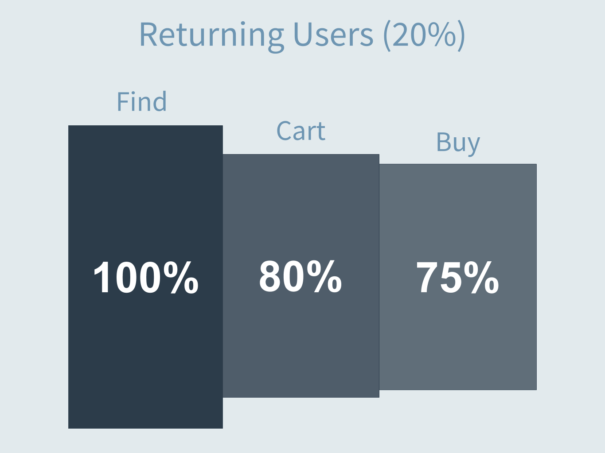
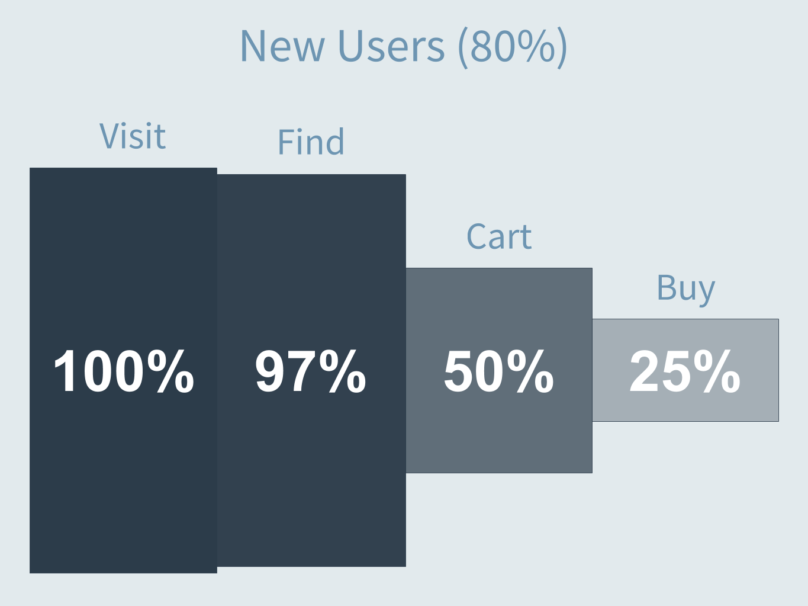
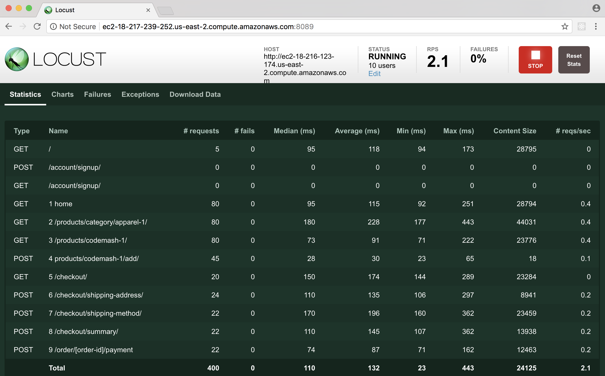

User Funnel Walkthrough
---------------------------

## Objective
Create a locust script that matches our user funnel

## Prerequisities
* Saleor running and accessible via web browser
* Locust installed on ec2 node
* SSH to locust machine

## Getting started

### Open browser to Saleor instance
1. Go into the ec2 web view and copy the `Public DNS` value

1. Open a browser to that URL `http://<Saleor DNS>` (Chrome will be used below):


### Update locustfile.py
1. Next, use a console to SSH into your locust machine.

1. On the locust machine, update git so that we're at a good starting point.

    ```bash
    ubuntu@locust:~$ cd ~/loadtest
    ubuntu@locust:~/loadtest$ git fetch origin
    ubuntu@locust:~/loadtest$ git reset --hard origin/user_funnel
    ```

1.  Open `locustfile.py` in your text editor of choice.

## User Funnel

After working with our stakeholder team, we've created an anticipated user funnel for our CodeMash Hoodiepocalypse.

We project that 80% of our users will be new to the site.  20% will be part of our loyal customer base.  We believe that the two user groups will act differently, with the returning users very likely to buy and the new users being a little less certain.





## Weight Users

If we look at the initial `locustfile.py`, we'll find that it's much denser than the previous exercises.  In it we've defined two user types `Visitor` and `ReturningUser` and a set of behavior for each.  The `SharedTasks` and `Helpers` that make up the majority of the file won't be modifed during this exercise.

```python
class Visitor(HttpLocust):
    task_set = VisitorBehavior
    host = HOST
    min_wait = MIN_WAIT
    max_wait = MAX_WAIT

class ReturningUser(HttpLocust):
    task_set = ReturningUserBehavior
    host = HOST
    min_wait = MIN_WAIT
    max_wait = MAX_WAIT
```

The `Visitor` or `ReturningUser` class is a "locust" in our LoadTest.  Each locust is a user that will follow a `task_set`.  The `min_wait` and `max_wait` provide the window where our user will wait between tasks.  So the `Visitor` locust will do one task from `VisitorBehavior` and then wait 5-9 seconds before doing another task.  The `ReturningUser` locust will do one task from `ReturningUserBehavior` and then sleep 5-9 seconds before doing another task.

Our first objective is to tell locust how many of our users should be of each type.  We do this using a `weight` attribute.  Based on our funnel, we want 80% of our users to be `Visitor` and 20% to be `ReturningUser`:

```python
class Visitor(HttpLocust):
    weight = 80
    task_set = VisitorBehavior
    host = HOST
    min_wait = MIN_WAIT
    max_wait = MAX_WAIT

class ReturningUser(HttpLocust):
    weight = 20
    task_set = ReturningUserBehavior
    host = HOST
    min_wait = MIN_WAIT
    max_wait = MAX_WAIT
```


So if we launch locust with 5000 simulated users, it will create 4000 `Visitor` locusts and 1000 `ReturningUser` locusts.  

## Weight Returning User Tasks

If we move up the `locustfile.py` we'll see the  `ReturningUserBehavior` tasks:

```python
class ReturningUserBehavior(TaskSet, SharedTasks):
    def on_start(self):
        self.register_user()

    @task
    def search(self):
        self.find_hoodie()

    @task
    def bail_on_cart(self):
        self.find_hoodie()
        self.add_to_cart()

    @task
    def buy(self):
        self.find_hoodie()
        self.add_to_cart()
        self.checkout()
```

This is the `TaskSet` for our `ReturningUser` locust.  Tasks are just python methods with a `@task` decorator.   So the `ReturningUser` locust will wake up, do one of `search`, `bail_on_cart`, or `buy` and then go back to sleep.

The `on_start` method is a helper provided by locust to allow us to do one-time setup for each locust that uses this task set.  In this case, we're doing the setup to make this locust a registered user in our system.

Right now, each time the locust wakes up to do a new task it will pick one of our three tasks will equal weighting.  So we would expect that when a locust executed 30 times (sleeping between each run), it will have done each task 10 times.

According to our user funnel we don't want an equal weighting.


In this simplistic example, the tasks are constructed so that all 3 tasks do "find" and 2 of the tasks do "cart".  So we can compose the funnel by working backwards from the most complete task.

* `buy` = (find + cart + buy) -> 75%
* `bail_on_cart` = (find + cart) -> 5%
* `search` = (find) -> 20%

To weight tasks in locust, pass an argument to the `@task` decorator:

```python
class ReturningUserBehavior(TaskSet, SharedTasks):
    def on_start(self):
        self.register_user()

    @task(20)
    def search(self):
        self.find_hoodie()

    @task(5)
    def bail_on_cart(self):
        self.find_hoodie()
        self.add_to_cart()

    @task(75)
    def buy(self):
        self.find_hoodie()
        self.add_to_cart()
        self.checkout()
```

In both of these cases we picked weights that added up to 100% because it was easy to reason about.  Weights of 4, 1, and 15 would result in the same distribution.  If a `ReturningUser` locust ran 40 times we'd expect:

* 30x `buy`
* 8x `search`
* 2x `bail_on_cart`

### Weight Visitor Tasks

Now we can move up to `VisitorBehavior` and do something very similar.

```python
class VisitorBehavior(TaskSet, SharedTasks):
    @task
    def just_visiting(self):
        self.client.get("/")

    @task
    def search(self):
        self.find_hoodie()

    @task
    def bail_on_cart(self):
        self.find_hoodie()
        self.add_to_cart()

    @task
    def buy(self):
        self.find_hoodie()
        self.add_to_cart()
        self.checkout()

```

Recall our funnel for new users:


And do something similar with the weighting:

```python
class VisitorBehavior(TaskSet, SharedTasks):
    @task(3)
    def just_visiting(self):
        self.client.get("/")

    @task(47)
    def search(self):
        self.find_hoodie()

    @task(25)
    def bail_on_cart(self):
        self.find_hoodie()
        self.add_to_cart()

    @task(25)
    def buy(self):
        self.find_hoodie()
        self.add_to_cart()
        self.checkout()
```

## Fire up locust

1. Save the file and close your editor
1. Re-find/copy the public DNS name for saleor: `http://<Saleor DNS>`
1. Start locust:

    ```bash
    ubuntu@locust:~/loadtest$ locust --host http://<Saleor DNS>
    ```
    It should look something like this:

    ```bash
    ubuntu@locust:~/loadtest$ locust --host http://ec2-18-217-108-45.us-east-2.compute.amazonaws.com
    [2017-12-24 02:58:54,522] ip-172-31-43-238/INFO/locust.main: Starting web monitor at *:8089
    [2017-12-24 02:58:54,522] ip-172-31-43-238/INFO/locust.main: Starting Locust 0.8
    ```

1. Now we need the Public DNS for the Load Test machine:


1. Open a browser to `http://<LoadTest DNS>:8089`


1. Enter 10 for "Number of users" and 5 for "Hatch rate".  Click "Start swarming"

1. Verify that requests are happening and that there are no failures.  Success!


In the example above we can see that we searched for the hoodie about 3.5x as often as we bought, and added it to cart 2x as often as we bought, which is in line with our funnel.

## Conclusion
You've successfully executed a load test script that can handle multiple user flows with a weighted distribution of tasks.  You're ready to start establishing a baseline and looking for bottlenecks.
